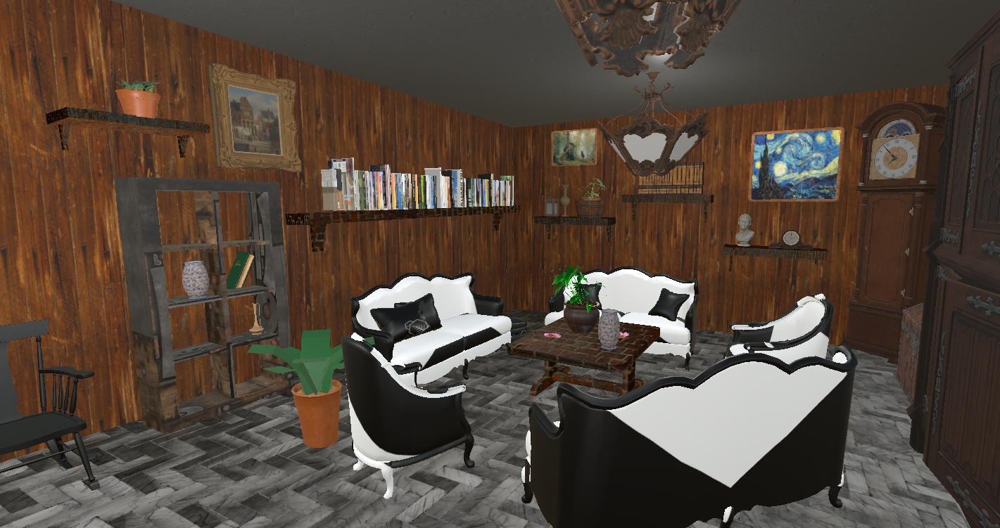

  

# The antique museum
## Realized by: 
Mina Etesam
## Degree course: 
Laurea Magistrale in Fashion studies, campus di Rimini, A.A. 2021/22
## Exam: 
Advanced Information and Communication Technologies for Fashion Lab

## Project description: 
This project is about creating an antique museum with two rooms. The first room is a common area where you can sit and relax while accessing many traditional books. The second room is the antique gallery where you can find various interesting things to explore. 
